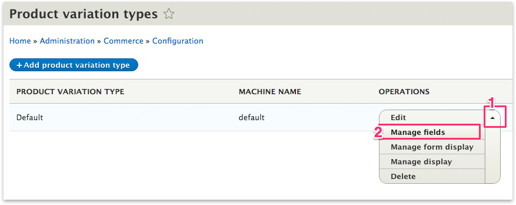
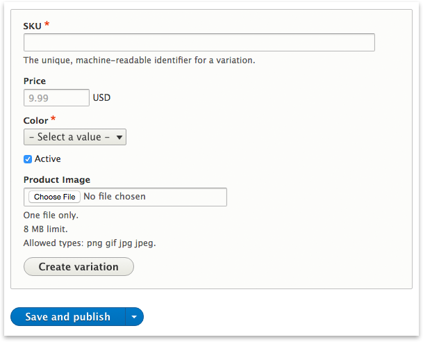

Make a product
==============

Every product has one or more variations. In the event that a product
has more than one variation, each variation is differentiated by some
aspect of the product, whether it’s the product’s color, size, fabric,
etc.

.. figure:: images/product_entity_relationships.png
   :alt: Product Entity Relationships

   Product Entity Relationships

For example, you sell t-shirts (Product Type) and you have a new
shipment of a particular Drupalcon t-shirt (Product). This Drupalcon
t-shirt comes in different sizes and colors. Each combination of size
and color (Small Red, Large Blue) represents a physical version of the
t-shirt (Product Variation).

    **NOTE**: In order to create your first product, you will need to
    have a store and a currency already set up. If you don't have this,
    there's a `Getting Started <../getting-started.rst>`__ section that
    will walk you through the steps.

Managing Products and their Variations
--------------------------------------

By default, variations are only manageable from the parent product,
using Inline Entity Form. Variations do not have labels or titles.
Labels, by default, are dynamically constructed from the attribute
labels. To create or update a product variation, you must go to the
product screen and either choose an existing product or create a new
one.

You can simply go to ``admin/commerce/products`` and click "Add
Product."

.. figure:: ../images/product-add.png
   :alt: Product select

   Product select

Once you have selected an existing product or added a new one, you will
be presented with a form that looks similar to the following. It will
have "product details" like title, description, and path. And a widget
for creating an unlimited number of variations that have prices, skus,
and any available attributes.

.. figure:: ../images/product-add-fullpage.png
   :alt: Product edit screen

   Product edit screen

Deleting a product deletes its variations. Adding a variation to a
product automatically creates a backreference on the variation, accessed
via $variation->getProduct().

Product Fields
--------------

Products can have all kinds of fields. Often Commerce products will have
a very media-rich set of content that is used to describe and present
the product. These fields will remain the same and be available no
matter which product variation is selected on the product page. Perhaps
all of our t-shirt products have videos that show off Drupalers
sprinting while wearing each of the t-shirts. We will need a field that
accepts video urls and can render them for the page.

Adding a Product Field
~~~~~~~~~~~~~~~~~~~~~~

Product types, for example, our tshirt product type, can be found at
``admin/commerce/config/product-types`` (under the configuration menu
option) and clicking on the arrow next to the Edit button will reveal
all the management tasks for product variation types. Click on the
``Manage Fields`` option.

Once on the manage fields screen for our product type, you can add as
many types of fields as you like by clicking the ``+ Add Field`` button.

Variation Fields
----------------

Products variations can have attributes and other kinds of fields. Going
back to our t-shirt analogy from above, if our t-shirts come in sizes
and colors, perhaps the product variation should have an image field so
you can upload a picture of a small red shirt. These kinds of
non-attribute fields are loaded dynamically when variations are chosen.

Adding a Product Variation Field
~~~~~~~~~~~~~~~~~~~~~~~~~~~~~~~~

Product variation types can be found at
``admin/commerce/config/product-variation-types`` and clicking on the
arrow next to the Edit button (1) will reveal all the management tasks
for product variation types. Click on the ``Manage Fields`` option (2).

   Manage Fields

Once there, you can add as many types of fields as you like. Note that
attributes that you have added in the past will show up here as entity
reference fields. For our example, we will be adding an image field.

.. figure:: images/product_variation_manage_field.png
   :alt: Add a field

   Add a field

Choose the kind of field you would like to add and setup any of the
settings as you need.

.. figure:: images/product_variation_add_product_image.png
   :alt: Add an image field

   Add an image field

Finally, you should have your new field showing up in your product add
form located at ``product/add``

   New Field Available

Managing the display of the product
-----------------------------------

Once the tshirt has important content fields and the t-shirt variation
fields have differentiating fields figured out, the product page may not
look as clean the designer envisioned. It's likely that there are a
number of labels for fields (like price, product image, SKU, etc) that
you would rather not display. There are two different ``Manage Display``
locations you will need to manage in order to get the desired output on
your product page.

    **NOTE**: It's recommended that if you are using display modes to
    effect the product pages, that you use the "show weights" check box.
    The reason for this is that when a product is rendered, all fields,
    from the variation to the actual product get sorted based on weight.
    So if you just use the drag and drop methods, you will not get the
    granular control you might expect.

To fully control the display of all the fields it's helpful to think of
the fields as being a part of one big group.

.. figure:: images/product_display_visual.png
   :alt: Manage Display field weight graphic

   Manage Display field weight graphic

Above, our T-shirt Product fields (body, variations) are rendered with
our T-shirt Product Variation fields (Price, Image). In order to achieve
this order, the field weights must be manually set to go in order, as if
they were in a large group.

Product field weight can be managed here:
``admin/commerce/config/product-types``

Product Variation field weight can be managed here:
``admin/commerce/config/product-variation-types``

    **FANCY FEATURE ALERT**: You may have noticed that product variation
    fields can be displayed INDEPENDENTLY of the variations field. Lots
    of work has gone in to making sure these fields get replaced easily
    and consistently when a new product is selected on the add-to-cart
    form. This was developed specifically to allow fine-tuned control of
    how a store would want to present different pieces of information.
    Perhaps you really need the picture of the selected t-shirt to
    appear before the body field of the product. Just change the weight
    :)
