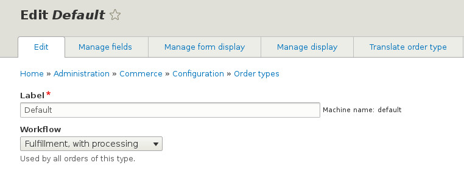

How to Create a Custom Order Workflow
=====================================

In many cases, the default order workflows may not provide the states and transitions that match a store's operational processes. Commerce 2 allows developers to create custom workflows that fit custom requirements.

In this tutorial we show you how to create a custom workflow, building on top of the Fulfillment workflow provided by the Commerce Order module. Let's suppose that processing and fulfilling an order are two separate steps for our store. This could be because different staff process the order e.g. verify payment and check availability, and different staff packages and ships the products.

Defining a Workflow
-------------------

An order workflow is defined in a YAML configuration file in a custom or contrib module, let's call it ``my_module``. The file should be called ``my_module.workflows.yml`` and it should be created at the root folder of the module. Drupal Commerce will automatically detect the file and load the workflows defined in it, after you clear the caches.

Have a look at the original definition of the Fulfillment workflow. We are going to add a Processing state and specify that the order should move from Draft, to Processing, to Fulfillment, and finally to Completed state.

.. code-block:: yaml

    // my_module.workflows.yml

    my_module_fulfillment_processing:
      id: my_module_fulfillment_processing
      group: commerce_order
      label: 'Fulfillment, with processing'
      states:
        draft:
          label: Draft
        processing:
          label: Processing
        fulfillment:
          label: Fulfillment
        completed:
          label: Completed
        canceled:
          label: Canceled
      transitions:
        place:
          label: 'Place order'
          from: [draft]
          to: processing
        process:
          label: 'Process order'
          from: [processing]
          to: fulfillment
        fulfill:
          label: 'Fulfill order'
          from: [fulfillment]
          to: completed
        cancel:
          label: 'Cancel order'
          from: [draft, processing, fulfillment]
          to:   canceled

Associating the Order Type with the Workflow
--------------------------------------------

Once the workflow is registered, we need to associate an order type with it. We will assume that we use the default order type for this example. Visit ``/admin/commerce/config/order-types`` and select to Edit the default workflow. Use the workflow dropdown to choose the "Fulfill, with processing" option.

   Associating the Order Type with the New Workflow

On a production site you may want to export the Order Type as configuration and that would contain its workflow association as well - see `Managing your site's configuration <https://www.drupal.org/docs/8/configuration-management/managing-your-sites-configuration>`_.

Testing the Result
------------------

Once the workflow is registered and it is associated with an order type, store managers should be able to move the order through the define states via the defined transitions. Place a test order and go to its View admin page. The order should be automatically put in the Processing state and you should be able to move it to the Fulfillment state by clicking the "Process order" button (indicating that the order has been processed), and then to the Completed state by clicking the "Fulfill order" button.

You can also cancel the order at any step, as defined in the workflow's transitions.

.. figure:: images/process_order.jpg
   :alt: Moving an Order from Processing to Fulfillment

   Moving an Order from Processing to Fulfillment

.. figure:: images/fulfill_order.jpg
   :alt: Moving an Order from Fulfillment to Completed

   Moving an Order from Fulfillment to Completed

Subscribing to Transition Events
--------------------------------

In many cases we may want to do more when a transition occurs than simply moving the order to the next state. Let's say that we want to send an email to the customer when an order has been processed and is awaiting for fulfillment. That should happen when a store manager clicks on the "Process order" button in the example above.

The state_machine module that provides the foundation for the workflows emits two events when a transition occurs. The events are named ``commerce_order.TRANSITION_ID.TRANSITION_PHASE``, where TRANSITION_ID is the key of the transition's definition in the YAML file, and TRANSITION_PHASE is "pre_transition" for the first event that is emitted just before the transition has occurred, and "post_transition" for the second event that is emitted just after it.

In our case we want to send the email after the transition to the Fulfillment state has occurred. We therefore need to create an event subscriber that listens to the ``commerce_order.fulfill.post_transition`` event.

Here is an example that you can modify according to your requirements.

.. code-block:: php

    // my_module/src/EventSubscriber/OrderFulfillmentSubscriber.php

    namespace Drupal\my_module\EventSubscriber;

    use Drupal\state_machine\Event\WorkflowTransitionEvent;
    use Drupal\Core\Language\LanguageManagerInterface;
    use Drupal\Core\Mail\MailManagerInterface;
    use Drupal\Core\StringTranslation\StringTranslationTrait;
    use Symfony\Component\EventDispatcher\EventSubscriberInterface;

    /**
     * Sends an email when the order transitions to Fulfillment.
     */
    class OrderFulfillmentSubscriber implements EventSubscriberInterface {

      use StringTranslationTrait;

      /**
       * The language manager.
       *
       * @var \Drupal\Core\Language\LanguageManagerInterface
       */
      protected $languageManager;

      /**
       * The mail manager.
       *
       * @var \Drupal\Core\Mail\MailManagerInterface
       */
      protected $mailManager;

      /**
       * Constructs a new OrderReceiptSubscriber object.
       *
       * @param \Drupal\Core\Language\LanguageManagerInterface $language_manager
       *   The language manager.
       * @param \Drupal\Core\Mail\MailManagerInterface $mail_manager
       *   The mail manager.
       */
      public function __construct(LanguageManagerInterface $language_manager, MailManagerInterface $mail_manager) {
        $this->languageManager = $language_manager;
        $this->mailManager = $mail_manager;
      }

      /**
       * {@inheritdoc}
       */
      public static function getSubscribedEvents() {
        $events = [
          'commerce_order.fulfill.post_transition' => ['sendEmail', -100],
        ];
        return $events;
      }

      /**
       * Sends the email.
       *
       * @param \Drupal\state_machine\Event\WorkflowTransitionEvent $event
       *   The transition event.
       */
      public function sendEmail(WorkflowTransitionEvent $event) {
        // Create the email.
        $order = $event->getEntity();
        $to = $order->getEmail();
        $params = [
          'from' => $order->getStore()->getEmail(),
          'subject' => $this->t(
            'Regarding your order [#@number]',
            ['@number' => $order->getOrderNumber()]
          ),
          'body' => $this->t(
            'Your order with #@number that you have placed with us has been processed and is awaiting fulfillment.',
            ['@number' => $order->getOrderNumber()]
          ),
        ];

        // Set the language that will be used in translations.
        if ($customer = $order->getCustomer()) {
          $langcode = $customer->getPreferredLangcode();
        }
        else {
          $langcode = $this->languageManager->getDefaultLanguage()->getId();
        }

        // Send the email.
        $this->mailManager->mail('commerce_order', 'receipt', $to, $langcode, $params);
      }

    }

Note that the following functions are made available by the event, if you need to execute more advanced logic based on the state that you are coming from or the workflow that the transition is part of.

.. code-block:: php

    $fromState = $event->getFromState();
    $toState = $event->getToState();
    $workflow = $event->getWorkflow();

At last, don't forget to register your event subscriber.

.. code-block:: yaml

    // my_module/my_module.services.yml

    services:
      my_module.order_fulfillment_subscriber:
        class: Drupal\my_module\EventSubscriber\OrderFulfillmentSubscriber
        arguments: ['@language_manager', '@plugin.manager.mail']
        tags:
          - { name: event_subscriber }
